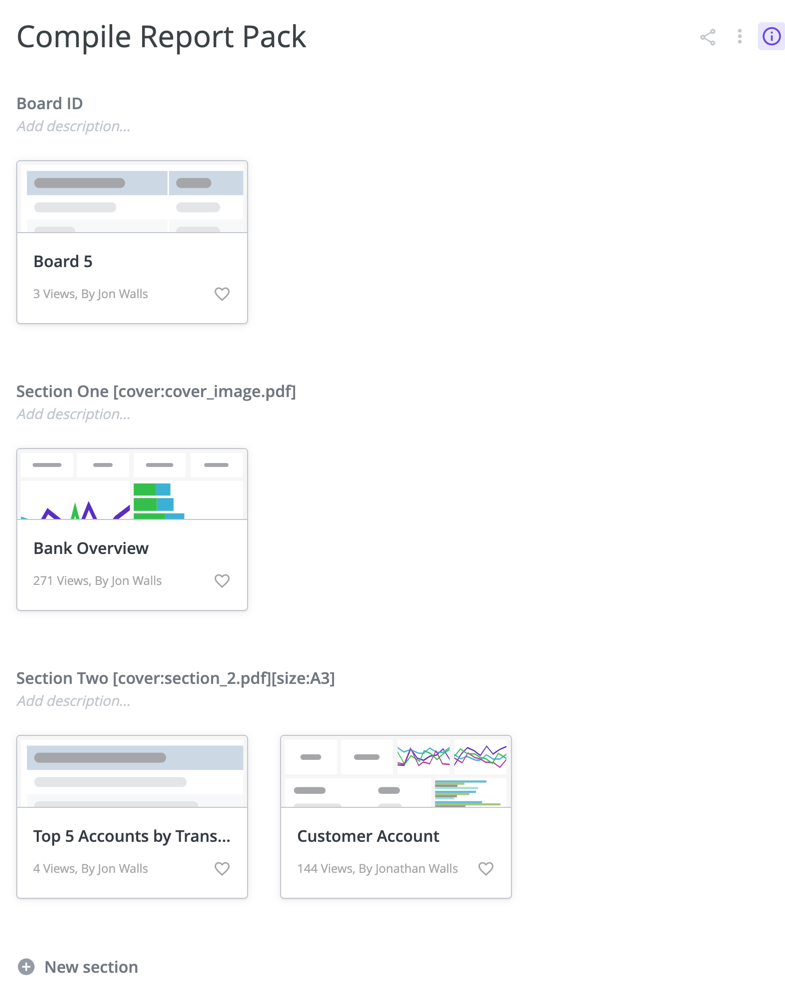

# compile-report-pack
Single-action Looker Action Hub using Python + FastAPI. Includes SendGrid for emails.

# User Information

1. Create a board
2. Add at least two sections
   - The first section must contain a look that includes a `board_id` value in the first row
   - Adding a Table Calculation with the name "Board ID" is the easiest way to do this
   - This `board_id` refers to the number of the board, taken from the end of the board's URL
     - e.g. https://your-instance.looker.com/browse/boards/5
3. In the second section onwards, all dashboards will be included as pages in the compiled report
4. You can add a look which includes filter values, to generate multiple pages of the same dashboard with different filter settings (e.g. one page per department)
5. Using the section description, you can define a header page to be included
   - These have to be stored on the Action Hub application in the input/compile_report_pack directory
   - Example: Section Two [cover:section_2.pdf]
6. Using the section description, you can set pages to be printed as A3 rather than A4
   - Example: Section Two [cover:section_2.pdf][size:A3]

# Administrator Information

## SDK credentials must be configured as environment variables or added to start script
NOTE: This project assumes that you have set SDK credentials as environment variables.

## To run
Requites Python 3.7+. To run locally:

1. `python3 -m venv .venv`
2. `source .venv/bin/activate`
3. `pip install -r requirements.txt`
4. `cp start.example start`
5. Update environment variables in start script
4. `./start`

## Adding a new action

Any new, conforming action added to the actions folder will automatically be added to the Action Hub.

See the original Fast Hub project for more examples: [https://github.com/ContrastingSounds/fast-hub](Fast Hub project on GitHub)
